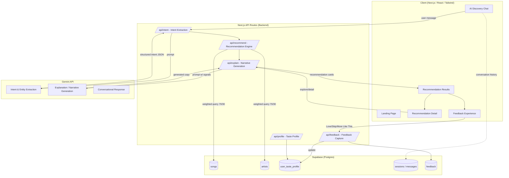
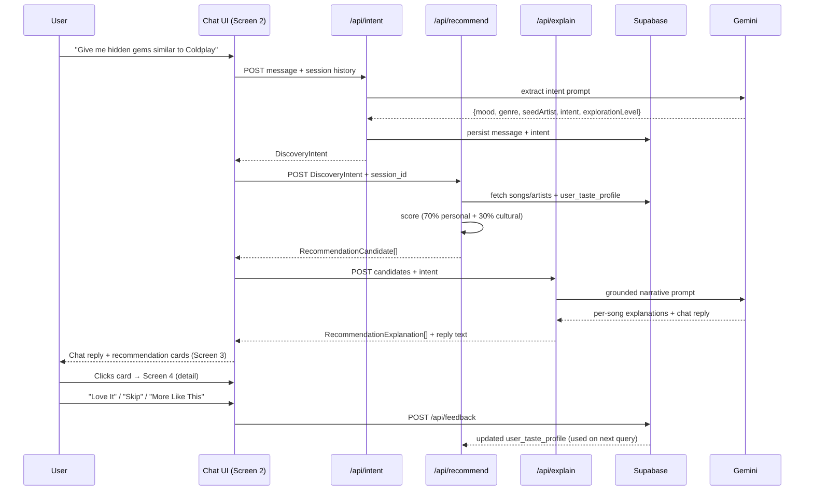

# Raga – Phase-Wise Technical Architecture

This document translates the [Problem Statement](./problemStatement.md) into a concrete, buildable, phase-wise architecture for the Raga MVP (AI Discovery Companion + Cultural Discovery Layer).

**Related docs:** [Implementation Plan](./implementationPlan.md) · [Edge Cases](./edgeCases.md) · [Folder Structure](./folderStructure.md) · [Gemini Limits](./gemini-limits.md)

---

## 1. Architectural Principles

* **Thin backend, smart layers** — Next.js API routes act as orchestration layers between the UI, Supabase, and Gemini. No separate microservices for the MVP.
* **Deterministic data, generative narration** — Recommendation *selection* is driven by deterministic scoring logic against structured data (so results are explainable and reproducible). Gemini is used to *narrate* (explain, describe, converse), not to invent song data.
* **Composable scoring** — The 70/30 (Personal Taste / Cultural Discovery) weighting is implemented as a configurable scoring function so it can be tuned without re-architecting.
* **Explainability by design** — Every recommendation object carries the structured signals (`why_you_like_it`, `why_interesting`, `discovery_source`) needed to render explanations, rather than deriving them ad hoc in the UI.
* **Stateless API, stateful session** — API routes are stateless; conversation + taste-profile state lives in Supabase (`sessions`, `feedback`, `user_taste_profile`) so the app can be refreshed/shared via a public URL without losing context.
* **Ship incrementally** — Each phase below produces a deployable, demoable increment on Vercel, matching the MVP/case-study nature of the project.

---

## 2. High-Level System Architecture



---

## 3. Data Architecture (Supabase / Postgres)

### 3.1 `songs`
| Column | Type | Notes |
|---|---|---|
| id | uuid (PK) | |
| song_name | text | |
| artist_id | uuid (FK → artists.id) | |
| genre | text | e.g. indie, lo-fi, electronic |
| mood | text[] | e.g. {energetic, chill, melancholic} |
| popularity | int (0-100) | proxy for mainstream-ness |
| emerging_artist_flag | boolean | |
| hidden_gem_flag | boolean | |
| community_buzz_score | numeric (0-1) | proxy for Reddit/community trend signal |
| album_art_url | text | |
| audio_preview_url | text (optional) | |
| created_at | timestamptz | |

### 3.2 `artists`
| Column | Type | Notes |
|---|---|---|
| id | uuid (PK) | |
| name | text | |
| genres | text[] | |
| similar_artists | text[] | used for "Similar Artists" / exploration path |
| bio | text | optional flavor text for Gemini grounding |

### 3.3 `user_taste_profile`
| Column | Type | Notes |
|---|---|---|
| id | uuid (PK) | |
| session_id | uuid (FK → sessions.id) | anonymous, browser-session based for MVP |
| preferred_genres | text[] | inferred + explicit |
| favorite_artists | text[] | seeded or inferred from chat |
| mood_history | jsonb | rolling log of extracted moods |
| exploration_level | text | conservative / balanced / adventurous |
| updated_at | timestamptz | |

### 3.4 `sessions` / `messages`
| Column | Type | Notes |
|---|---|---|
| session_id | uuid (PK) | |
| messages | jsonb[] | chat turn history (role, content, extracted_intent) |
| created_at | timestamptz | |

### 3.5 `feedback`
| Column | Type | Notes |
|---|---|---|
| id | uuid (PK) | |
| session_id | uuid (FK) | |
| song_id | uuid (FK → songs.id) | |
| action | text | `love` \| `skip` \| `more_like_this` |
| created_at | timestamptz | |

Feedback writes back into `user_taste_profile` (e.g. `love` reinforces genre/artist weight; `skip` decays it; `more_like_this` triggers a re-query biased toward that song's genre/artist/mood).

---

## 4. Phase-Wise Build Plan

### Phase 0 — Foundation & Environment Setup
**Goal:** A deployable "hello world" skeleton on Vercel with Supabase and Gemini wired up.

**Scope:**
* Initialize Next.js (App Router) + TypeScript + Tailwind CSS project.
* Configure Supabase project; store connection via `NEXT_PUBLIC_SUPABASE_URL` / `SUPABASE_SERVICE_ROLE_KEY` (server-only) env vars.
* Configure Gemini API key (`GEMINI_API_KEY`, server-only).
* Set up base folder structure:
  ```
  /app
    /(marketing)/page.tsx        -> Landing Page
    /chat/page.tsx                -> AI Discovery Chat
    /results/page.tsx             -> Recommendation Results
    /results/[songId]/page.tsx    -> Recommendation Detail
    /api/intent/route.ts
    /api/recommend/route.ts
    /api/explain/route.ts
    /api/feedback/route.ts
    /api/profile/route.ts
  /lib
    /supabase/client.ts
    /gemini/client.ts
    /scoring/recommend.ts
  /components
  /types
  ```
* Configure Vercel project + preview deployments; set up `.env.example`.
* Establish base design tokens in Tailwind config (dark theme, Spotify-green `#1DB954` accent, typography scale).

**Deliverable:** Empty-shell app deployed to a public Vercel URL, with a styled dark-theme landing page and working Supabase/Gemini connectivity smoke-tested via a test API route.

---

### Phase 1 — Data Layer & Sample Dataset
**Goal:** A realistic, queryable music dataset backing all discovery logic.

**Scope:**
* Create Supabase tables per §3 (`songs`, `artists`, `user_taste_profile`, `sessions`, `feedback`) with migrations (SQL in `/supabase/migrations`).
* Generate a curated sample dataset (~150–300 songs across 10–15 genres) with realistic values for `popularity`, `emerging_artist_flag`, `hidden_gem_flag`, `community_buzz_score`, mood tags, and album art (placeholder/generated images or public-domain art).
* Write a seed script (`/scripts/seed.ts`) to populate Supabase.
* Build a thin data-access layer (`/lib/data/songs.ts`, `/lib/data/artists.ts`) with typed query functions (by genre, mood, artist similarity, hidden-gem filter, etc.).
* Add Supabase Row Level Security (RLS) policies: public read on `songs`/`artists`, restricted write via service role only.

**Deliverable:** Fully seeded Supabase database + typed data-access functions, verifiable via a debug API route that lists songs by filter.

---

### Phase 2 — Intent Extraction (AI Discovery Companion, Core NLU)
**Goal:** Convert natural-language user input into structured intent.

**Scope:**
* Design a Gemini prompt/schema (via structured output / JSON mode) that extracts:
  ```ts
  interface DiscoveryIntent {
    mood?: string[];
    activity?: string;
    genre?: string[];
    seedArtist?: string;
    intent: "similar_to" | "mood_based" | "activity_based" | "trending" | "general_discovery";
    explorationLevel: "conservative" | "balanced" | "adventurous";
  }
  ```
* Implement `/api/intent` route: takes raw user message + short conversation history → calls Gemini → returns validated `DiscoveryIntent` (validate with Zod; retry once on malformed JSON).
* Handle ambiguous/low-signal input gracefully (fallback to `general_discovery` with a clarifying follow-up question surfaced in chat).
* Persist each turn (`user message`, `extracted intent`) to `sessions.messages`.

**Deliverable:** `/api/intent` reliably turns example prompts from the problem statement ("Recommend music for a late-night drive", "hidden gems similar to Coldplay", etc.) into structured intent, testable via a small test harness/script.

---

### Phase 3 — Recommendation Engine (Personalization + Cultural Discovery Signals)
**Goal:** Deterministic, explainable scoring engine implementing the 70/30 weighting.

**Scope:**
* Implement `/lib/scoring/recommend.ts`:
  * **Personal Taste Score (70%)** — computed from: genre/mood/artist match to `DiscoveryIntent` + `user_taste_profile` (favorite artists, preferred genres, mood history).
  * **Cultural Discovery Score (30%)** — computed from: `hidden_gem_flag`, `emerging_artist_flag`, `community_buzz_score`, inverse of `popularity` (favoring less mainstream tracks), weighted by `explorationLevel`.
  * Final score = `0.7 * personalScore + 0.3 * culturalScore`, with `explorationLevel` allowed to shift the split (e.g. "adventurous" → 50/50) as a tunable parameter, not hardcoded.
* Candidate generation: query Supabase for songs matching genre/mood/similar-artist filters (SQL `WHERE` + array overlap), then rank in-memory by the score above; return top N (e.g. 6–8) with score breakdown attached for transparency.
* Implement `/api/recommend` route: `DiscoveryIntent` (+ `session_id`) in → ranked list of `RecommendationCandidate` out, each candidate carrying the raw signals needed for explanation:
  ```ts
  interface RecommendationCandidate {
    song: Song;
    artist: Artist;
    personalScore: number;
    culturalScore: number;
    finalScore: number;
    matchedSignals: {
      genreMatch?: string;
      moodMatch?: string;
      isHiddenGem: boolean;
      isEmergingArtist: boolean;
      communityBuzzScore: number;
    };
  }
  ```

**Deliverable:** `/api/recommend` returns ranked, scored, explainable candidates for any given intent — independently testable without the UI or Gemini narration layer.

---

### Phase 4 — Explanation & Narrative Generation
**Goal:** Turn scored candidates into the human-facing "Why You'll Like It" / "Why It's Interesting" copy, plus conversational replies.

**Scope:**
* Implement `/api/explain`: takes a batch of `RecommendationCandidate` + original intent → single Gemini call (batched prompt) → returns per-song:
  ```ts
  interface RecommendationExplanation {
    songId: string;
    whyYoullLikeIt: string;   // grounded in personalScore signals
    whyInteresting: string;   // grounded in culturalScore signals
    discoverySource: string;  // e.g. "Trending in indie Reddit communities"
    explorationPath: string[]; // suggested next artists/genres to explore
  }
  ```
* Prompt is strictly grounded — Gemini is given the *actual* matched signals (genre, mood, buzz score, hidden-gem flag) and instructed to explain using only that data (prevents hallucinated facts about real artists).
* Implement conversational reply generation for the chat UI (friendly, concise, references extracted intent — e.g. "Got it — energetic tracks for a workout. Here's what I found 🎧").
* Merge `/api/recommend` + `/api/explain` into a single orchestrated response consumed by the frontend (either as one combined endpoint or the chat route calling both server-side).

**Deliverable:** End-to-end API flow: raw user text → intent → scored candidates → narrated recommendation cards, fully testable via `curl`/Postman before any UI exists.

---

### Phase 5 — Frontend Experience (Screens 1–4)
**Goal:** Build the five required screens with premium, Spotify-inspired UI.

**Scope:**
* **Screen 1 — Landing Page:** Raga branding/hero, discovery search box, suggested prompt chips (pulled from the example prompts in the problem statement), dark theme + green accent.
* **Screen 2 — AI Discovery Chat:** ChatGPT-style streaming conversation UI (message bubbles, typing indicator), input box, calls `/api/intent` → `/api/recommend` → `/api/explain` (or a combined `/api/chat` orchestrator), renders recommendation cards inline as chat results.
* **Screen 3 — Recommendation Results:** Grid/list of recommendation cards (album art, artist, song, short discovery explanation snippet), responsive mobile-first layout.
* **Screen 4 — Recommendation Detail View:** Full rationale (`whyYoullLikeIt`, `whyInteresting`), `discoverySource`, similar artists, exploration path — deep-link route `/results/[songId]`.
* Shared UI system: `Card`, `Button`, `Badge` (e.g. "Hidden Gem", "Emerging Artist"), `ChatBubble`, `LoadingSkeletons` — built with Tailwind + a small headless-UI/shadcn-style primitive set.
* Client-side state via React context or lightweight store (e.g. Zustand) for session/conversation state; `session_id` persisted in a cookie/localStorage.

**Deliverable:** Fully navigable, responsive, visually polished UI across Screens 1–4, wired to live API responses (no more mock data).

---

### Phase 6 — Feedback Loop & Personalization (Screen 5)
**Goal:** Close the loop — feedback actively reshapes future recommendations.

**Scope:**
* **Screen 5 — Feedback Experience:** Inline actions on each recommendation card/detail view: `Love It`, `Skip`, `More Like This`.
* `/api/feedback` route: records action in `feedback` table, then applies an update rule to `user_taste_profile`:
  * `Love It` → reinforce genre/artist/mood weights (+), nudge `explorationLevel` slightly toward current recommendation's discovery type.
  * `Skip` → decay weight for that genre/artist/mood.
  * `More Like This` → immediately triggers a follow-up `/api/recommend` call biased toward the selected song's genre/artist/mood/buzz profile, surfaced back in the chat as a new turn.
* Update `/api/recommend` to read `user_taste_profile` at query time so subsequent sessions/turns reflect accumulated feedback.
* Add lightweight analytics logging (counts of love/skip/more-like-this per session) to support the "demonstrate improved discovery" narrative for the case study.

**Deliverable:** Feedback actions visibly change subsequent recommendations within the same session — the core "meaningful discovery improves over time" proof point for the MVP.

---

### Phase 7 — Polish, Hardening & Deployment
**Goal:** Production-quality MVP, publicly accessible, demo-ready.

**Scope:**
* UX polish: loading/skeleton states, empty states, error states (Gemini timeout/failure fallback to a graceful message), micro-interactions/animations (Framer Motion) on card reveal and feedback actions.
* Accessibility pass (contrast on dark theme, keyboard navigation, ARIA labels for chat).
* Performance: streaming Gemini responses where possible, response caching for repeated intents, image optimization (Next.js `<Image>`) for album art.
* Guardrails: input validation/sanitization on chat input, rate limiting on API routes, prompt-injection mitigation in Gemini prompts (system instructions constraining output to JSON/grounded facts).
* Environment/secrets audit; confirm `SUPABASE_SERVICE_ROLE_KEY` and `GEMINI_API_KEY` are server-only (never exposed to client bundle).
* Final Vercel production deployment; smoke test full user journey end-to-end on the public URL.
* Write a short `README.md` covering setup, architecture summary, and demo script for stakeholders (supports the "Product Management case-study" framing).

**Deliverable:** Publicly deployed, demo-ready Raga MVP satisfying all items in "Expected Deliverables" of the problem statement.

---

## 5. End-to-End Sequence (Runtime View)



---

## 6. Phase Summary Table

| Phase | Focus | Key Output |
|---|---|---|
| 0 | Foundation & Setup | Deployed skeleton app, env wired |
| 1 | Data Layer | Seeded Supabase dataset + data-access layer |
| 2 | Intent Extraction | `/api/intent` — NLU via Gemini |
| 3 | Recommendation Engine | `/api/recommend` — 70/30 scoring engine |
| 4 | Explanation Generation | `/api/explain` — grounded narrative generation |
| 5 | Frontend Screens 1–4 | Landing, Chat, Results, Detail UI |
| 6 | Feedback Loop (Screen 5) | Love/Skip/More Like This → personalization |
| 7 | Polish & Deployment | Hardened, public, demo-ready MVP |

---

## 7. Non-Functional Considerations

* **Explainability:** Every recommendation must be traceable to structured signals — no "black box" LLM-only recommendations.
* **Latency:** Target < 3–4s perceived response time; use skeleton loaders and optionally stream the chat reply while cards render.
* **Cost control:** Batch Gemini calls (one call per intent extraction, one batched call for all card explanations) rather than per-card LLM calls. Enforce free-tier limits per [Gemini Limits](./gemini-limits.md) — max **2 calls/chat turn**, **20 RPD** total (`gemini-2.5-flash`).
* **Extensibility:** Scoring weights, exploration levels, and dataset are all externalized/configurable so the concept can later plug into real Spotify data or a larger catalog without re-architecting.
* **Privacy:** MVP uses anonymous session-based profiles (no auth required) — sufficient for a case-study demo, with a clear upgrade path to real user auth (Supabase Auth) if extended beyond MVP.
