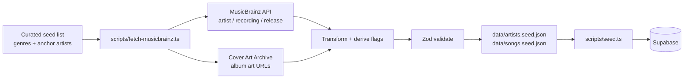

# Phase 1 – Data Sourcing Plan (MusicBrainz)

This document outlines how to build Raga's MVP music dataset using **MusicBrainz** as the legal metadata backbone, with **deterministic rules** for fields MusicBrainz does not provide (popularity, mood, hidden gem, emerging artist, community buzz).

**Related docs:** [Implementation Plan](./implementationPlan.md) · [Architecture](./architecture.md) · [Edge Cases](./edgeCases.md)

---

## 1. Goals & Constraints

| Goal | Detail |
|---|---|
| Dataset size | ~**200 songs** across **12–15 genres** |
| Legal source | MusicBrainz API + Cover Art Archive only (no Spotify scraping) |
| Determinism | Same input → same flags/scores (reproducible for demos) |
| MVP fit | Fields required by problem statement + scoring engine (Phase 3) |

| Constraint | Detail |
|---|---|
| Rate limit | MusicBrainz: **max 1 request/second**; meaningful `User-Agent` required |
| No popularity from MB | Popularity is **derived**, not fetched |
| No mood from MB | Mood is **assigned** via genre + tag rules |
| Idempotent pipeline | Re-running fetch/seed must not duplicate rows |

---

## 2. End-to-End Pipeline



### Commands (target workflow)

```bash
# 1. Fetch metadata from MusicBrainz → seed JSON files
npx tsx scripts/fetch-musicbrainz.ts

# 2. Validate seed files only (no DB write)
npx tsx scripts/fetch-musicbrainz.ts --validate-only

# 3. Load seed JSON into Supabase
npx tsx scripts/seed.ts

# 4. Verify via debug route (dev)
curl "http://localhost:3000/api/debug/songs?genre=indie&hiddenGem=true"
```

---

## 3. MusicBrainz API Usage

### Base URL & headers

```
GET https://musicbrainz.org/ws/2/{entity}/{mbid}?fmt=json&inc=...
```

| Header | Value |
|---|---|
| `User-Agent` | `RagaDiscoveryCompanion/0.1 (contact@yourdomain.com)` |
| `Accept` | `application/json` |

> Replace the contact email with a real address before running bulk fetches.

### Endpoints used

| Step | Endpoint | Purpose |
|---|---|---|
| Artist lookup | `GET /artist/{mbid}?inc=tags+url-rels` | Name, MBID, genre tags |
| Artist search | `GET /artist?query=...&limit=5` | Resolve anchor artist names → MBID |
| Recording search | `GET /recording?query=artist:{name}&limit=25` | Candidate tracks per artist |
| Release lookup | `GET /release/{mbid}?inc=release-groups` | Link recording → release group for art |
| Cover art | `GET https://coverartarchive.org/release/{mbid}/front` | 307 redirect → image URL (store final URL) |

### Rate limiting (mandatory)

Implement in `scripts/lib/musicbrainz-client.ts`:

```ts
// Minimum 1100ms between requests (1 req/sec + buffer)
await sleep(1100);
```

On **503** response: exponential backoff (2s → 4s → 8s), max 3 retries.

### Attribution

Store provenance on every seed record:

```json
{
  "source": "musicbrainz",
  "musicbrainz_artist_mbid": "b10bbbfc-cf9e-42e0-be17-e52b4b8ca7a8",
  "musicbrainz_recording_mbid": "a3d3eac8-7a02-4468-ab17-7b7d7a43cca4"
}
```

Include MusicBrainz attribution in `README.md` per [CC0 / community guidelines](https://musicbrainz.org/doc/Licensing).

---

## 4. Curated Seed List (Input to Fetch Script)

Before calling the API, define a **static curator file** that controls genre diversity and discovery mix.

**File:** `data/seed-config.json`

```json
{
  "targetSongCount": 200,
  "songsPerGenre": { "min": 12, "max": 18 },
  "genres": [
    "indie", "electronic", "lo-fi", "jazz", "folk",
    "hip-hop", "r-n-b", "rock", "ambient", "soul",
    "classical", "latin", "world", "metal", "pop"
  ],
  "anchorArtists": {
    "indie": ["Big Thief", "Snail Mail", "Japanese Breakfast"],
    "electronic": ["Bonobo", "Tycho", "Four Tet"],
    "lo-fi": ["Nujabes", "J Dilla", "Idealism"]
  },
  "discoveryMix": {
    "hiddenGemTargetPct": 0.25,
    "emergingArtistTargetPct": 0.20,
    "mainstreamAnchorPct": 0.30
  }
}
```

The fetch script:
1. Expands anchor artists via MusicBrainz search.
2. Pulls recordings per artist until genre quotas are met.
3. Applies flag rules (§6) and trims to ~200 songs.

---

## 5. Seed JSON Schema

Validated with **Zod** in `scripts/schemas/seed.ts` before writing files or seeding DB.

### 5.1 `data/artists.seed.json`

```ts
const ArtistSeedSchema = z.object({
  id: z.string().uuid(),                    // deterministic v5 UUID from MBID
  name: z.string().min(1),
  genres: z.array(z.string()).min(1),
  similar_artists: z.array(z.string()).default([]),
  bio: z.string().optional(),
  source: z.literal("musicbrainz"),
  musicbrainz_artist_mbid: z.string().uuid(),
  // Derived / enriched (not from MB directly)
  artist_popularity_proxy: z.number().int().min(0).max(100),
  emerging_artist_flag: z.boolean(),
});
```

**Example record:**

```json
{
  "id": "8f3e2a1b-4c5d-6e7f-8a9b-0c1d2e3f4a5b",
  "name": "Snail Mail",
  "genres": ["indie", "rock"],
  "similar_artists": ["Soccer Mommy", "Phoebe Bridgers", "Clairo"],
  "bio": "American indie rock project of Lindsey Jordan.",
  "source": "musicbrainz",
  "musicbrainz_artist_mbid": "a74b1b7f-71a5-3961-8ccc-9d59a383b9d1",
  "artist_popularity_proxy": 42,
  "emerging_artist_flag": true
}
```

### 5.2 `data/songs.seed.json`

```ts
const SongSeedSchema = z.object({
  id: z.string().uuid(),                    // deterministic v5 UUID from recording MBID
  song_name: z.string().min(1),
  artist_id: z.string().uuid(),             // FK → artists.seed.json
  artist_name: z.string().min(1),           // denormalized for seed script convenience
  genre: z.string().min(1),                 // primary Raga genre (single)
  mood: z.array(z.string()).min(1).max(3),
  popularity: z.number().int().min(0).max(100),
  emerging_artist_flag: z.boolean(),
  hidden_gem_flag: z.boolean(),
  community_buzz_score: z.number().min(0).max(1),
  album_art_url: z.string().url().optional(),
  audio_preview_url: z.string().url().optional(),
  source: z.literal("musicbrainz"),
  musicbrainz_recording_mbid: z.string().uuid(),
  musicbrainz_release_mbid: z.string().uuid().optional(),
});
```

**Example record:**

```json
{
  "id": "c1d2e3f4-a5b6-7890-abcd-ef1234567890",
  "song_name": "Pristine",
  "artist_id": "8f3e2a1b-4c5d-6e7f-8a9b-0c1d2e3f4a5b",
  "artist_name": "Snail Mail",
  "genre": "indie",
  "mood": ["melancholic", "introspective"],
  "popularity": 38,
  "emerging_artist_flag": true,
  "hidden_gem_flag": true,
  "community_buzz_score": 0.72,
  "album_art_url": "https://coverartarchive.org/release/.../front-500.jpg",
  "source": "musicbrainz",
  "musicbrainz_recording_mbid": "..."
}
```

### 5.3 Deterministic UUIDs

Use **UUID v5** with a fixed namespace so re-fetching the same MBID yields the same `id`:

```ts
import { v5 as uuidv5 } from "uuid";

const RAGA_NAMESPACE = "6ba7b810-9dad-11d1-80b4-00c04fd430c8"; // fixed project namespace
const artistId = uuidv5(musicbrainzArtistMbid, RAGA_NAMESPACE);
const songId = uuidv5(musicbrainzRecordingMbid, RAGA_NAMESPACE);
```

> Add `uuid` package in Phase 1: `npm install uuid` + `@types/uuid`.

### 5.4 Supabase column mapping

| Seed JSON field | Supabase column | Notes |
|---|---|---|
| `id` | `artists.id` / `songs.id` | Pre-generated UUIDs |
| `name` | `artists.name` | |
| `genres` | `artists.genres` | `text[]` |
| `similar_artists` | `artists.similar_artists` | From MB relations or curator list |
| `bio` | `artists.bio` | Wikipedia URL rel or short curator text |
| `song_name` | `songs.song_name` | |
| `artist_id` | `songs.artist_id` | FK |
| `genre` | `songs.genre` | Single primary genre |
| `mood` | `songs.mood` | `text[]` |
| `popularity` | `songs.popularity` | Derived (§6.1) |
| `emerging_artist_flag` | `songs.emerging_artist_flag` | Derived (§6.2) |
| `hidden_gem_flag` | `songs.hidden_gem_flag` | Derived (§6.3) |
| `community_buzz_score` | `songs.community_buzz_score` | Derived (§6.4) |
| `album_art_url` | `songs.album_art_url` | Cover Art Archive |
| Provenance fields | *not stored in MVP DB* | Optional `metadata jsonb` column later |

---

## 6. Derivation Rules (Flags & Scores)

MusicBrainz provides **tags** (community genre/style labels) and **relations** (similar artists). Everything below is computed deterministically in `scripts/lib/derive-signals.ts`.

### 6.1 Popularity proxy (`popularity` 0–100)

MusicBrainz has no Spotify-style popularity. Use a weighted proxy:

```
popularity = clamp(0, 100,
  0.40 * tagCountScore
+ 0.35 * releaseRecencyScore
+ 0.25 * artistTagScore
)
```

| Signal | Calculation |
|---|---|
| `tagCountScore` | `min(100, recording_tag_count * 8)` — more tags ≈ more discussed |
| `releaseRecencyScore` | Releases in last 3 years → 70–100; 3–10 years → 40–69; 10+ years → 10–39 |
| `artistTagScore` | `min(100, artist_tag_count * 5)` |

**Calibration targets for MVP mix:**

| Tier | Popularity range | ~% of dataset |
|---|---|---|
| Mainstream anchor | 65–95 | ~30% |
| Mid-tier | 35–64 | ~45% |
| Niche / low | 5–34 | ~25% |

> Intentionally avoid uniform distribution — the scoring engine needs contrast.

### 6.2 Emerging artist flag

An artist is **emerging** when **≥2** of these are true:

| # | Rule | Threshold |
|---|---|---|
| 1 | First release within last **5 years** | `artist_active_years <= 5` |
| 2 | Low tag count (underground signal) | `artist_tag_count < 15` |
| 3 | Low popularity proxy | `artist_popularity_proxy < 45` |
| 4 | Genre tag includes niche markers | tag ∈ `{indie, underground, bedroom, experimental, lo-fi, emo}` |

```ts
emerging_artist_flag =
  [rule1, rule2, rule3, rule4].filter(Boolean).length >= 2;
```

Song inherits artist flag: `song.emerging_artist_flag = artist.emerging_artist_flag`.

**Target:** ~20% of songs flagged emerging (adjust curator list if QA fails).

### 6.3 Hidden gem flag

A song is a **hidden gem** when **all** of:

| # | Rule | Condition |
|---|---|---|
| 1 | Low mainstream reach | `popularity < 40` |
| 2 | Quality / community signal | `community_buzz_score >= 0.55` |
| 3 | Not a legacy mega-hit | `releaseRecencyScore >= 30` OR `tagCountScore >= 25` |

```ts
hidden_gem_flag =
  popularity < 40
  && community_buzz_score >= 0.55
  && (releaseRecencyScore >= 30 || tagCountScore >= 25);
```

**Override (curator):** Songs manually tagged `"hidden-gem"` in `seed-config.json` force `hidden_gem_flag = true`.

**Target:** ~25% of songs flagged hidden gem.

### 6.4 Community buzz score (`community_buzz_score` 0–1)

Proxy for "trending in communities" without Reddit scraping:

```
community_buzz_score = clamp(0, 1,
  0.35 * normalizedTagCount
+ 0.30 * nicheGenreBoost
+ 0.20 * recencyBoost
+ 0.15 * hiddenGemCandidateBoost
)
```

| Component | Formula |
|---|---|
| `normalizedTagCount` | `min(1, recording_tag_count / 12)` |
| `nicheGenreBoost` | `1.0` if genre ∈ `{indie, lo-fi, experimental, folk, ambient}` else `0.5` |
| `recencyBoost` | `1.0` if release < 2 years; `0.7` if 2–5 years; `0.4` otherwise |
| `hiddenGemCandidateBoost` | `1.0` if `popularity < 40` AND `tagCountScore >= 25`; else `0.3` |

### 6.5 Mood assignment

MusicBrainz tags don't map 1:1 to moods. Use a **genre → mood prior** table with tag overrides:

**File:** `data/genre-mood-map.json`

```json
{
  "indie": ["melancholic", "introspective", "chill"],
  "electronic": ["energetic", "hypnotic", "chill"],
  "lo-fi": ["chill", "melancholic", "dreamy"],
  "hip-hop": ["energetic", "confident", "groovy"],
  "ambient": ["dreamy", "chill", "ethereal"],
  "rock": ["energetic", "raw", "anthemic"],
  "jazz": ["smooth", "sophisticated", "chill"],
  "folk": ["warm", "introspective", "acoustic"],
  "metal": ["intense", "aggressive", "energetic"],
  "pop": ["upbeat", "catchy", "energetic"]
}
```

**Assignment algorithm:**

1. Start with **2 moods** from genre prior (first two in array).
2. If MB recording tag matches a mood keyword (`energetic`, `sad`, `chill`, etc.), **replace** second mood with matched mood.
3. Deduplicate; cap at **3** moods.

### 6.6 Genre normalization (MusicBrainz → Raga taxonomy)

Map MB tags to one **primary** Raga genre via priority table in `scripts/lib/genre-map.ts`:

| MusicBrainz tag (examples) | Raga genre |
|---|---|
| `indie rock`, `indie pop`, `indie` | `indie` |
| `electronic`, `house`, `techno`, `downtempo` | `electronic` |
| `lo-fi`, `chillhop`, `instrumental hip hop` | `lo-fi` |
| `jazz`, `bebop`, `smooth jazz` | `jazz` |
| `folk`, `singer-songwriter`, `acoustic` | `folk` |
| `hip hop`, `rap`, `trap` | `hip-hop` |
| `r&b`, `soul`, `neo soul` | `r-n-b` / `soul` |
| `rock`, `alternative rock`, `punk` | `rock` |
| `ambient`, `drone`, `new age` | `ambient` |
| `pop`, `dance pop`, `synthpop` | `pop` |
| `metal`, `heavy metal`, `black metal` | `metal` |
| `classical`, `orchestral` | `classical` |
| `latin`, `reggaeton`, `salsa` | `latin` |
| `world`, `afrobeat`, `celtic` | `world` |

If no match: assign from **curator genre** in `seed-config.json` for that artist.

### 6.7 Similar artists

Priority order:
1. MusicBrainz `artist-relation` type `similar` / `influenced by` (reverse)
2. Other artists in seed dataset sharing ≥1 genre tag (max 3)
3. Curator list in `seed-config.json`

---

## 7. Fetch Script Design

**File:** `scripts/fetch-musicbrainz.ts`

### CLI flags

| Flag | Description |
|---|---|
| `--config <path>` | Path to `seed-config.json` (default: `data/seed-config.json`) |
| `--validate-only` | Validate existing seed JSON; no API calls |
| `--dry-run` | Fetch + transform but don't write files |
| `--limit <n>` | Override target song count (for testing) |
| `--verbose` | Log each API call and derived flags |

### Module structure

```
scripts/
  fetch-musicbrainz.ts          # CLI entrypoint
  lib/
    musicbrainz-client.ts       # Rate-limited HTTP client
    cover-art.ts                # Cover Art Archive resolver
    genre-map.ts                # MB tag → Raga genre
    derive-signals.ts           # Popularity, flags, buzz, mood
    similar-artists.ts          # Similar artist resolution
  schemas/
    seed.ts                     # Zod schemas for seed JSON
```

### Pseudocode

```ts
async function main() {
  const config = loadSeedConfig("data/seed-config.json");
  const artists: ArtistSeed[] = [];
  const songs: SongSeed[] = [];

  for (const [genre, anchorNames] of Object.entries(config.anchorArtists)) {
    for (const name of anchorNames) {
      const mbArtist = await mb.searchArtist(name);
      const artist = await buildArtistRecord(mbArtist, genre);
      artists.push(artist);

      const recordings = await mb.searchRecordings(artist.name, { limit: 25 });
      for (const rec of recordings) {
        if (songs.length >= config.targetSongCount) break;
        const song = await buildSongRecord(rec, artist, genre);
        songs.push(song);
      }
    }
  }

  songs = rebalanceGenreQuotas(songs, config);
  songs = enforceDiscoveryMix(songs, config.discoveryMix);

  const validatedArtists = ArtistSeedSchema.array().parse(artists);
  const validatedSongs = SongSeedSchema.array().parse(songs);

  writeJson("data/artists.seed.json", validatedArtists);
  writeJson("data/songs.seed.json", validatedSongs);
  printQaReport(validatedSongs);
}
```

### `enforceDiscoveryMix`

After derivation, if flag percentages are off-target:
- **Too few hidden gems:** lower `popularity` threshold locally for borderline songs OR add curator overrides.
- **Too many:** raise `community_buzz_score` threshold for hidden gem rule.
- Log warnings; never randomly flip flags (stay deterministic).

---

## 8. Seed Script (`scripts/seed.ts`)

Unchanged from implementation plan, with idempotent upsert:

```ts
// Upsert artists then songs using service-role Supabase client
await supabase.from("artists").upsert(artists, { onConflict: "id" });
await supabase.from("songs").upsert(songs, { onConflict: "id" });
```

**Pre-flight checks:**
- All `song.artist_id` exist in `artists.seed.json`
- Zod validation passes
- QA report thresholds met (§9)

---

## 9. QA Report (printed after fetch)

The fetch script prints a summary; **fail** (exit code 1) if hard constraints aren't met:

| Check | Target | Hard fail? |
|---|---|---|
| Total songs | 180–220 | Yes |
| Unique genres | ≥ 12 | Yes |
| `hidden_gem_flag = true` | 20–30% | Yes |
| `emerging_artist_flag = true` | 15–25% | Yes |
| `popularity` range used | min < 20 AND max > 70 | Yes |
| `community_buzz_score` range | min < 0.3 AND max > 0.8 | Yes |
| Songs with `album_art_url` | ≥ 80% | Warn only |
| Orphan `artist_id` FKs | 0 | Yes |
| Duplicate `musicbrainz_recording_mbid` | 0 | Yes |

**Sample output:**

```
✓ Songs: 200 | Artists: 87 | Genres: 14
✓ Hidden gems: 26% (52/200)
✓ Emerging artists: 22% (44/200)
✓ Popularity: 8–91 | Buzz: 0.21–0.89
⚠ Album art coverage: 76% (target 80%)
```

---

## 10. Album Art Strategy

1. Resolve `release_mbid` from recording → release lookup.
2. `GET https://coverartarchive.org/release/{release_mbid}` → parse `images[0].thumbnails.small` or `front` URL.
3. If missing: fallback to `public/images/placeholder-album.png` (store absolute app URL or relative path).

**Rate limit:** Cover Art Archive shares MusicBrainz infrastructure — keep **1 req/sec**.

---

## 11. Phase 1 File Checklist

| File | Action |
|---|---|
| `data/seed-config.json` | Create — curator input |
| `data/genre-mood-map.json` | Create — mood priors |
| `scripts/fetch-musicbrainz.ts` | Create — MB fetch CLI |
| `scripts/lib/musicbrainz-client.ts` | Create |
| `scripts/lib/derive-signals.ts` | Create |
| `scripts/lib/genre-map.ts` | Create |
| `scripts/lib/cover-art.ts` | Create |
| `scripts/schemas/seed.ts` | Create — Zod schemas |
| `data/artists.seed.json` | Generated by fetch script |
| `data/songs.seed.json` | Generated by fetch script |
| `scripts/seed.ts` | Create — Supabase loader |
| `supabase/migrations/0001_init.sql` | Create — schema + RLS |

---

## 12. Edge Cases (data pipeline)

| ID | Scenario | Handling |
|---|---|---|
| DS-01 | Artist not found in MB | Skip; log warning; try next anchor |
| DS-02 | Recording has no tags | Use genre prior only for mood; lower tag-based scores |
| DS-03 | Duplicate recording across artists | Dedupe by `musicbrainz_recording_mbid` |
| DS-04 | MB 503 rate limit | Exponential backoff (§3) |
| DS-05 | Cover art 404 | Use placeholder; warn in QA report |
| DS-06 | Genre quota not met | Pull additional artists from `seed-config` overflow list |
| DS-07 | All songs from one artist dominate | Cap **3 songs per artist** in final dataset |
| DS-08 | Re-run fetch on existing seeds | Deterministic UUIDs → safe upsert |

---

## 13. What we explicitly do NOT do

- ❌ Scrape Spotify or store Spotify metadata at scale
- ❌ Use LLM to invent song/artist facts during fetch (Gemini is Phase 4 for **narration only**)
- ❌ Pull live Reddit data (buzz score is a deterministic proxy)
- ❌ Commit `.env` or API keys

---

## 14. Implementation order (within Phase 1)

1. `supabase/migrations/0001_init.sql` — schema + RLS
2. `scripts/schemas/seed.ts` — Zod types
3. `data/seed-config.json` + `data/genre-mood-map.json`
4. `scripts/lib/*` — MB client, derive-signals, genre-map, cover-art
5. `scripts/fetch-musicbrainz.ts` — generate seed JSON
6. `scripts/seed.ts` — load into Supabase
7. `lib/data/songs.ts` + `lib/data/artists.ts` — query layer
8. `app/api/debug/songs/route.ts` — dev verification

---

## 15. Related updates

After implementing, update:
- [ ] `README.md` — MusicBrainz attribution + fetch/seed commands
- [ ] `docs/implementationPlan.md` Phase 1 tasks — reference this doc
- [ ] `.env.example` — optional `MUSICBRAINZ_USER_AGENT` if externalized
