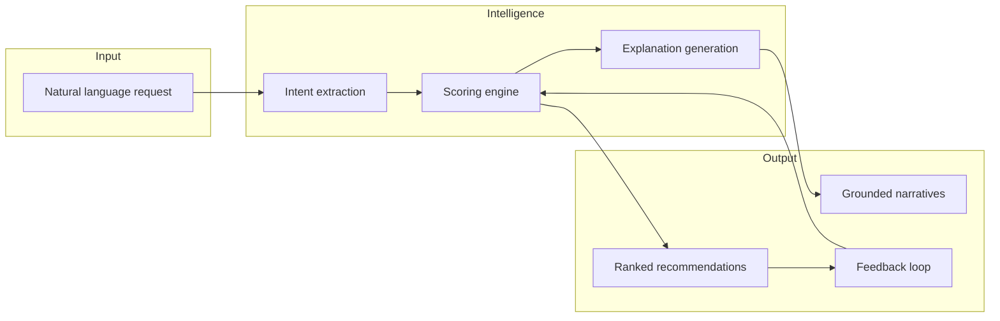

# Raga – Solution Overview

**AI Discovery Companion + Cultural Discovery Layer**

| | |
|---|---|
| **Product** | Raga |
| **Type** | Product Management case-study MVP |
| **Production URL** | [https://raga-music-recommendation.vercel.app](https://raga-music-recommendation.vercel.app) |
| **Repository** | [github.com/mirthsekar-hash/Raga-Music-Recommendation](https://github.com/mirthsekar-hash/Raga-Music-Recommendation) |
| **Status** | All 7 implementation phases complete |

---

## 1. Executive Summary

Raga is an AI-powered music discovery experience that helps **Discovery-Oriented Music Explorers** find music they are likely to enjoy but unlikely to discover on their own. Unlike platforms that optimize primarily for familiarity and engagement, Raga combines:

1. **Conversational AI** — natural-language understanding of mood, activity, genre, and discovery intent.
2. **Cultural discovery signals** — hidden gems, emerging artists, community buzz, and inverse-popularity weighting.
3. **Explainable recommendations** — every pick includes grounded rationale (“Why you’ll like it”, “Why it’s interesting”, discovery source, exploration path).
4. **Feedback-driven personalization** — Love, Skip, and More Like This reshape taste profiles within a session.

The MVP demonstrates the concept convincingly using a curated MusicBrainz-backed catalog (~200 songs), deterministic scoring for reproducibility, and Gemini for narration—not for inventing song data.

---

## 2. Problem Statement

Discovery-oriented listeners actively seek new artists, genres, and hidden gems, but mainstream recommendation systems often:

- Surface repetitive, familiar results.
- Trap users in existing listening patterns.
- Rarely highlight emerging or community-discovered music.
- Push users to external platforms (YouTube, Reddit, Instagram) for meaningful discovery.

Research shows users need **context, guidance, confidence, and explainability** before exploring unfamiliar music. Raga addresses this gap with an AI companion that guides exploration while surfacing culturally relevant, non-mainstream picks.

---

## 3. Solution Vision



**Core design principle:** *Deterministic data, generative narration.*

- **Selection** is driven by a transparent 70/30 (personal / cultural) scoring function.
- **Narration** is generated by Gemini using only structured signals attached to each candidate—preventing hallucinated facts about real artists.

---

## 4. Target Users

| Segment | Behavior | Raga value |
|---|---|---|
| **Discovery-Oriented Music Explorers** | Actively seek new artists and genres; leave mainstream apps for discovery | Adventurous exploration mode, hidden-gem badges, community buzz signals |
| **Context-driven listeners** | Music for activities (drive, workout, study) | Activity-based intent + mood matching |
| **Seed-artist explorers** | “Similar to X but more obscure” | `similar_to` intent + cultural score boost |
| **Community trend followers** | Want what’s buzzing in indie/niche scenes | Trending intent + Trending badge on cards |

---

## 5. Key Features

### 5.1 AI Discovery Companion

- ChatGPT-style conversational UI with streaming status updates (“Understanding…”, “Finding recommendations…”, “Writing explanations…”).
- Structured intent extraction: `similar_to`, `mood_based`, `activity_based`, `trending`, `general_discovery`.
- Exploration levels: `conservative`, `balanced`, `adventurous` (shifts personal/cultural weighting).
- Vague-input handling with clarifying questions (e.g. user says “music”).
- Off-topic guardrails — non-music questions receive a polite scope message without wasting Gemini quota.

### 5.2 Cultural Discovery Layer

| Signal | Source | Effect |
|---|---|---|
| Hidden gem flag | Curated seed data | Boosts cultural score; “Hidden Gem” badge |
| Emerging artist flag | Curated seed data | Boosts cultural score; “Emerging Artist” badge |
| Community buzz score | Derived 0–1 metric | Trending detection + explanation copy |
| Inverse popularity | `popularity` field (0–100) | Favors off-mainstream tracks when adventurous |
| Trending badge | `community_buzz_score ≥ 0.72` (or buzz + popularity combo) | Surfaces community-hot tracks |

### 5.3 Explainable Recommendations

Each recommendation card includes:

- **Why you’ll like it** — grounded in genre/mood/activity match and taste profile.
- **Why it’s interesting** — grounded in hidden-gem, emerging, trending, or buzz signals.
- **Discovery source** — e.g. “Indie community hidden gem”, “Trending in listener communities”.
- **Exploration path** — similar artists and genre suggestions for continued discovery.

### 5.4 Feedback Loop

| Action | Behavior |
|---|---|
| **Love** | Reinforces genre, artist, mood in `user_taste_profile` |
| **Skip** | Decays weights; skipped songs excluded from future recommendations in session |
| **More like this** | Biases next recommendation query; follow-up cards appear in chat |

### 5.5 Resilience & Degraded Mode

When Gemini quota is exhausted or the circuit breaker opens:

- Heuristic intent extraction replaces LLM intent parsing.
- Template explanations replace generated copy.
- Recommendations still return (scoring is fully deterministic).
- UI shows a degraded-service banner.

---

## 6. User Journey

| Step | Screen | User action | System response |
|---|---|---|---|
| 1 | Landing | Opens Raga | Branded hero, suggested prompt chips, search box |
| 2 | Chat | Enters natural language request | Intent extracted → songs scored → explanations generated |
| 3 | Chat / Results | Reviews recommendation cards | Album art, badges (Trending / Hidden Gem / Emerging), short explanation |
| 4 | Detail | Taps a card | Full rationale, discovery source, similar artists, exploration path |
| 5 | Feedback | Love / Skip / More like this | Profile updated; skipped tracks hidden; follow-up picks in chat |

**Example prompts:**

- “Recommend music for a late-night drive”
- “Suggest underrated indie artists”
- “Give me hidden gems similar to Coldplay”
- “I want something energetic for a workout”
- “Recommend songs trending in indie communities”

---

## 7. Application Screens

| Screen | Route | Description |
|---|---|---|
| Landing | `/` | Raga branding, discovery search, suggested prompts |
| AI Chat | `/chat` | Conversational discovery with inline recommendation cards |
| Results | `/results` | Full list of session recommendations |
| Detail | `/results/[songId]` | Deep-dive on a single pick |
| Feedback | `/feedback/[songId]` | Structured feedback form (Screen 5) |

**UI characteristics:** Dark theme, Spotify-inspired green accents (`#1DB954`), mobile-first responsive layout, Framer Motion micro-interactions, skeleton loaders, bottom navigation with Raga highlight.

---

## 8. Technical Architecture

### 8.1 Stack

| Layer | Technology |
|---|---|
| Frontend | Next.js 15, React 19, TypeScript, Tailwind CSS, Framer Motion, Zustand |
| Backend | Next.js API routes (serverless on Vercel) |
| Database | Supabase (PostgreSQL) |
| LLM | Google Gemini (`gemini-2.5-flash`) |
| Deployment | Vercel |
| Data sourcing | MusicBrainz (CC0) + Cover Art Archive |

### 8.2 High-Level Flow

```
User → POST /api/chat/stream
         ├─ sanitize input + relevance/offensive guards
         ├─ extract intent (Gemini → heuristic fallback)
         ├─ load taste profile + skipped songs
         ├─ score & rank songs (deterministic engine)
         ├─ generate explanations (Gemini → template fallback)
         └─ persist session + messages (Supabase)

Feedback → POST /api/feedback
         ├─ record feedback row
         ├─ update user_taste_profile
         └─ optional more-like-this follow-up
```

### 8.3 API Routes

| Route | Method | Purpose |
|---|---|---|
| `/api/health` | GET | Supabase + Gemini connectivity check |
| `/api/chat` | POST | Full orchestration (JSON response) |
| `/api/chat/stream` | POST | Same flow with NDJSON status events |
| `/api/intent` | POST | Intent extraction only |
| `/api/recommend` | POST | Scored recommendation candidates |
| `/api/explain` | POST | Grounded card explanations |
| `/api/feedback` | POST | Love / skip / more-like-this |

All mutation routes use **Zod validation**, **per-IP rate limiting**, and **Gemini quota enforcement**.

### 8.4 Key Server Modules

| Module | Responsibility |
|---|---|
| `lib/chat/orchestrate.ts` | End-to-end chat pipeline |
| `lib/intent/extract.ts` | Gemini intent + cache + heuristic fallback |
| `lib/intent/relevance.ts` | Off-topic detection (rule-based, no LLM cost) |
| `lib/scoring/recommend.ts` | Candidate gathering + ranking |
| `lib/scoring/scores.ts` | Personal + cultural score computation |
| `lib/explain/generate.ts` | Batched Gemini explanations + template fallback |
| `lib/gemini/generate.ts` | Single entry point for all LLM calls |
| `lib/gemini/quota.ts` | RPM/TPM/RPD enforcement |
| `lib/gemini/circuit-breaker.ts` | Fail-fast when Gemini is unhealthy |
| `lib/data/*` | Typed Supabase access (songs, artists, sessions, feedback, profile) |

---

## 9. Recommendation Engine

### 9.1 Scoring Model

Final score = `personalWeight × personalScore + culturalWeight × culturalScore`

Weights shift by exploration level:

| Exploration level | Personal | Cultural |
|---|---|---|
| Conservative | 80% | 20% |
| Balanced | 70% | 30% |
| Adventurous | 50% | 50% |

**Personal score components:** genre match, mood match, artist/similar-artist match, taste profile genres and favorites.

**Cultural score components:** hidden gem flag, emerging artist flag, community buzz score, inverse popularity.

### 9.2 Candidate Generation

Multi-stage query plan against Supabase:

1. Genre + mood overlap filters
2. Genre-only / mood-only relaxation
3. Similar-artist expansion for `similar_to` intent
4. Hidden-gem and emerging filters for adventurous queries
5. Pool merge, dedupe, rank in-memory, return top 6–8

### 9.3 Transparency

Every `RecommendationCandidate` carries:

- `personalScore`, `culturalScore`, `finalScore`
- `matchedSignals` (genre/mood match, flags, buzz, trending)

These signals are passed to Gemini for grounded explanations and are available for debugging/auditing.

---

## 10. AI & LLM Strategy

### 10.1 Gemini Usage

| Purpose | Calls per chat turn | Max output tokens |
|---|---|---|
| Intent extraction | 1 (+1 JSON retry) | 512 |
| Explanation batch | 1 (all cards) | 2048 |

**Budget (free tier):** ~5 RPM, 250k TPM, **20 RPD** → ~10 full chat sessions/day.

### 10.2 Guardrails

- System prompts constrain output to JSON schemas (Zod-validated).
- Explanations instructed to use only provided candidate signals.
- Input sanitization (`lib/sanitize.ts`) and prompt-injection mitigation.
- Intent caching for repeated prompts (`lib/intent/cache.ts`).
- Conversation history capped at last 10 turns.

### 10.3 Fallback Layers

| Layer | Trigger | Fallback |
|---|---|---|
| Intent | Quota / circuit open / JSON failure | `heuristicExtractIntent()` |
| Explain | Quota / circuit open / JSON failure | `templateExplanation()` |
| Relevance | Always first | Rule-based `isIrrelevantInput()` |

---

## 11. Data Architecture

### 11.1 Core Tables

| Table | Purpose |
|---|---|
| `artists` | Name, genres, similar artists, bio |
| `songs` | Catalog with mood, popularity, flags, buzz score, album art |
| `sessions` | Anonymous chat sessions with message history (JSONB) |
| `user_taste_profile` | Per-session preferred genres, favorite artists, mood history, exploration level |
| `feedback` | Love / skip / more_like_this events |
| `gemini_usage` | Daily LLM request counter for RPD enforcement |

### 11.2 Dataset Strategy

- **~200 songs** across **12–15 genres**, sourced from MusicBrainz.
- Derived fields: `popularity`, `emerging_artist_flag`, `hidden_gem_flag`, `community_buzz_score`, `mood[]`.
- Seed pipeline: `fetch-musicbrainz.ts` → `postprocess-seed.ts` → `seed.ts`.
- QA thresholds: ≥20% hidden gems, ≥15% emerging artists (see `docs/phase1-data-sourcing.md`).

### 11.3 Privacy Model

- Anonymous session-based profiles (no auth required for MVP).
- Clear upgrade path to Supabase Auth for production extension.
- Service role key and Gemini API key are **server-only** — never exposed to the client bundle.

---

## 12. Security & Production Hardening

| Control | Implementation |
|---|---|
| Input validation | Zod on all API request bodies |
| Rate limiting | Per-IP limits on chat/feedback routes |
| Secrets audit | `npm run audit:secrets` — scans client bundle |
| Security headers | `vercel.json` — X-Frame-Options, nosniff, etc. |
| Debug routes | `/api/debug/*` returns 404 in production |
| Health endpoint | Optional `HEALTH_CHECK_SECRET` in production |
| Serverless timeout | `maxDuration = 60` on chat/feedback/explain routes |
| Error boundaries | `app/error.tsx`, `app/not-found.tsx` |
| Offensive input | Safe refusal reply before intent extraction |

---

## 13. Quality Assurance

### 13.1 Integration Tests

| Script | Scope |
|---|---|
| `npm run test:intent` | Intent API against suggested prompts |
| `npm run test:scoring` | Deterministic scoring unit checks |
| `npm run test:recommend` | Recommendation API |
| `npm run test:chat` | Full chat orchestration |
| `npm run test:feedback` | Feedback + profile updates |
| `npm run smoke:test` | End-to-end journey on deployed URL |

### 13.2 Evals (Golden-Set Regression)

| Script | Scope | Gemini? |
|---|---|---|
| `npm run eval` | All offline suites | No |
| `npm run eval:relevance` | Off-topic vs on-topic guardrails (14 cases) | No |
| `npm run eval:intent` | Heuristic intent + vague input (11 cases) | No |
| `npm run eval:explain` | Template explanation grounding (4 cases) | No |
| `npm run eval:intent -- --live` | Live intent API scoring | Yes |

Fixtures: `evals/fixtures/intent-golden.json`, `evals/fixtures/relevance-golden.json`.

### 13.3 Edge Cases

`docs/edgeCases.md` documents **90+ scenarios** across Phases 0–7 (connectivity failures, empty catalogs, quota exhaustion, malformed LLM JSON, XSS, session loss, etc.) with expected behaviors and mitigations.

---

## 14. Deployment & Operations

### 14.1 Environments

| Environment | URL |
|---|---|
| Production | [raga-music-recommendation.vercel.app](https://raga-music-recommendation.vercel.app) |
| Vercel project | `mirthsekar-hashs-projects/raga-music-recommendation` |

### 14.2 Required Environment Variables

| Variable | Scope |
|---|---|
| `NEXT_PUBLIC_SUPABASE_URL` | Public |
| `NEXT_PUBLIC_SUPABASE_ANON_KEY` | Public |
| `SUPABASE_SERVICE_ROLE_KEY` | Server only |
| `GEMINI_API_KEY` | Server only |
| `GEMINI_MODEL` | Server (default: `gemini-2.5-flash`) |
| `HEALTH_CHECK_SECRET` | Optional |

### 14.3 Deploy Commands

```bash
git push origin main          # triggers Vercel preview/production
npx vercel deploy --prod --yes   # manual production deploy
TEST_BASE_URL=https://raga-music-recommendation.vercel.app npm run smoke:test
```

---

## 15. Implementation Phases (Completed)

| Phase | Focus | Status |
|---|---|---|
| 0 | Foundation & environment | ✅ |
| 1 | Data layer & MusicBrainz seed | ✅ |
| 2 | Intent extraction (NLU) | ✅ |
| 3 | Recommendation engine (70/30 scoring) | ✅ |
| 4 | Explanation & chat API | ✅ |
| 5 | Spotify-inspired UI (Screens 1–4) | ✅ |
| 6 | Feedback loop (Screen 5) | ✅ |
| 7 | Polish, hardening & deployment | ✅ |

---

## 16. Deliverables Checklist

| Deliverable | Status |
|---|---|
| Conversational music discovery | ✅ |
| Intent-aware recommendations | ✅ |
| Hidden gem recommendations | ✅ |
| Emerging artist discovery | ✅ |
| Recommendation explanations | ✅ |
| Feedback loop | ✅ |
| Modern production-quality UI | ✅ |
| Public Vercel deployment | ✅ |
| Documentation & demo script | ✅ |
| Test harness & eval suite | ✅ |

---

## 17. Demo Script (Stakeholder Walkthrough)

1. **Home** — Tap “Give me hidden gems similar to Coldplay” or open Chat.
2. **Chat** — Ask *“Underrated indie for a late-night drive”*; observe status updates.
3. **Cards** — Scroll recommendations; note Trending / Hidden Gem / Emerging badges.
4. **Results** — Open “View all results”; confirm skipped tracks are hidden.
5. **Detail** — Read full “Why you’ll like it” and “Why it’s interesting”.
6. **Feedback** — Submit Love or More like this; confirm follow-up picks in chat.
7. **Resilience** — If Gemini quota is exhausted, app still recommends with template explanations.

---

## 18. Future Extensibility

| Area | MVP today | Extension path |
|---|---|---|
| Catalog | ~200 MusicBrainz songs | Spotify/Apple Music APIs, larger vector index |
| Auth | Anonymous sessions | Supabase Auth + persistent user profiles |
| Scoring weights | Config in `lib/scoring/config.ts` | A/B testing, ML reranker |
| LLM | Gemini free tier | Paid tier, model routing, streaming explanations |
| Evals | Offline golden sets | Live explain eval, LLM-as-judge, CI on every PR |
| Rate limiting | In-memory per instance | Redis / edge rate limiter |
| Vector search | Not used | Semantic similarity for mood/lyrics |

---

## 19. Related Documentation

| Document | Description |
|---|---|
| [Problem Statement](./problemStatement.md) | User research, goals, required screens |
| [Architecture](./architecture.md) | Phase-wise technical design, data model, sequence diagrams |
| [Implementation Plan](./implementationPlan.md) | Tasks, files, acceptance criteria per phase |
| [Edge Cases](./edgeCases.md) | Failure modes and mitigations |
| [Evals](./evals.md) | Golden-set regression suite |
| [Gemini Limits](./gemini-limits.md) | Free-tier budget and enforcement |
| [Phase 1 Data Sourcing](./phase1-data-sourcing.md) | MusicBrainz pipeline and QA |
| [README](../README.md) | Setup, commands, deploy instructions |

---

## 20. Summary

Raga proves that **AI-guided discovery combined with cultural discovery signals** can deliver a more meaningful, explainable music exploration experience than familiarity-first recommendation alone. By separating deterministic selection from generative narration, the system remains auditable, resilient under LLM quota constraints, and demo-ready on a public URL—fulfilling the Product Management case-study MVP objective without requiring production-scale Spotify infrastructure.
